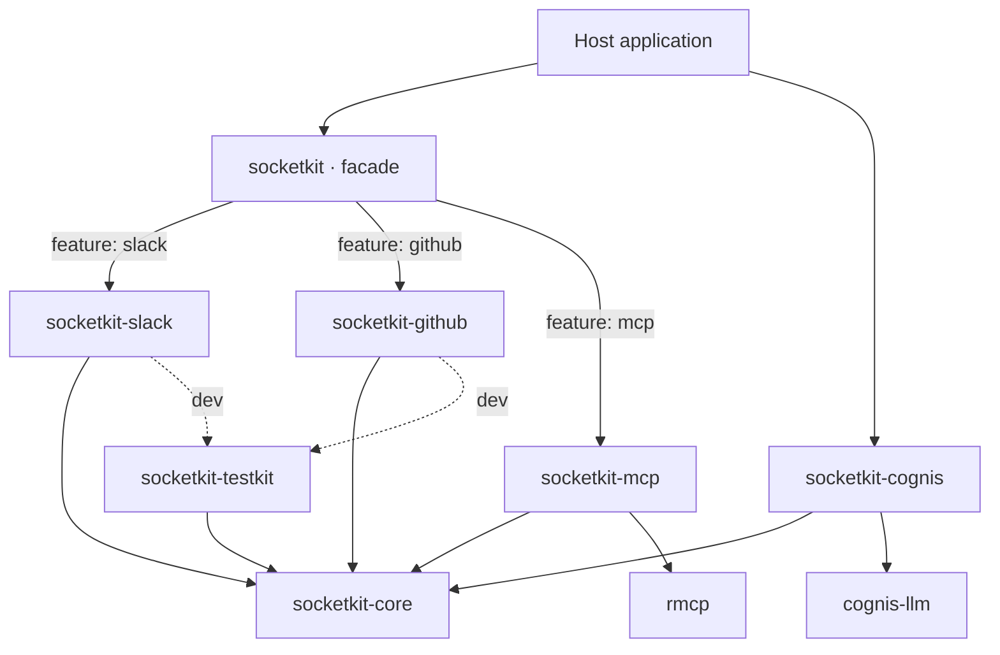
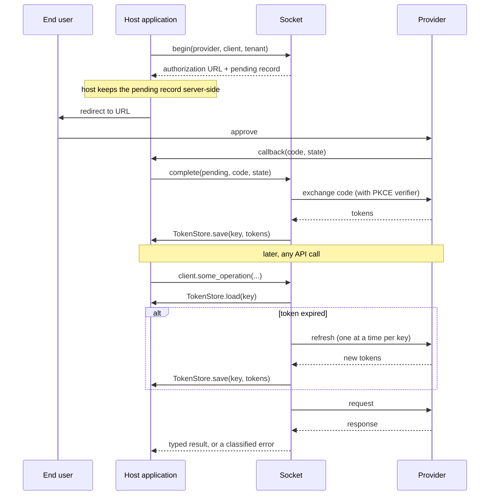
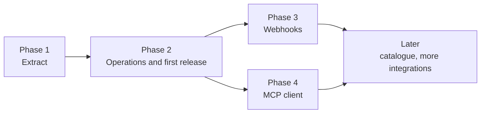

# Socket — project design

**Status:** Draft for review
**Date:** 2026-10-08
**Owner:** Vasanth
**Scope of this document:** the whole project: architecture, the core's design, the contract every integration follows, and the phases. Each phase gets its own detailed spec and implementation plan before work on it starts. Phase 1 is the first.

Read [the vision](../../vision.md) first for why the project exists. The evidence behind the choices here is in [the landscape research](../../research/2026-10-08-integrations-library-landscape.md); figures quoted below come from it and are dated 2026-10-08.

---

## 1. Summary

Socket is an open-source Rust library for connecting applications to external services. An application enables one Cargo feature per service and gets typed clients that share one auth layer, one error model, one retry policy and one pagination model. The application owns its OAuth apps and its token storage.

It is built as a Cargo workspace: a small core crate, one crate per integration, and a facade crate whose features switch integration crates on. It starts as an extraction of the `connector` crate that already exists, privately, inside the stev repository.

## 2. Goals and non-goals

### Goals

| # | Goal | How we know it is met |
| --- | --- | --- |
| G1 | Enable a service with one feature flag and get a typed client | The quickstart example compiles in CI and makes an authenticated call in about thirty lines |
| G2 | The application owns credentials | No code path reads an environment variable, writes a file, or contacts a Socket-operated host |
| G3 | One implementation serves backend code and AI agents | Every operation is callable as a typed method and as a self-describing tool |
| G4 | Adding an integration does not change the core | The fourth integration is added by touching only its own crate, one facade line and one docs row |
| G5 | Published integrations stay working | Every tier-one integration passes live tests on a schedule, or is demoted |

### Non-goals

- **Thousands of integrations.** Breadth comes from the provider catalogue and MCP (section 9), not from hand-written clients.
- **A unified data model across vendors.** No shared `Ticket` or `Message` type. Each integration keeps its vendor's shapes.
- **A hosted service** of any kind, including an OAuth callback proxy.
- **Workflow execution, agent loops, or LLM clients.** The agent harnesses in today's `connector` crate (`claude-code`, `openai`, `gemini`, `aider`, `acp`) are not integrations and do not move to Socket.
- **A sync engine.** Pagination is in scope. Incremental sync with stored cursors, change data capture and backfills are not, for now.
- **Runtime abstraction.** Socket targets Tokio and `reqwest`. It does not abstract over async runtimes.

## 3. Starting point: the `connector` crate

stev's `crates/connector` is 6,938 lines with one Cargo feature per integration. Reading it shows two very different halves.

| Part | Lines | Tests | Used by stev's API | What it is |
| --- | --- | --- | --- | --- |
| `oauth/` | 911 | 4 | Yes | Provider definitions for GitHub, Google, Linear, Notion, Slack and Zoom; signed state; code exchange; refresh |
| `resource/` | 1,196 | 41 | Yes | Checks that a repository, channel, team or document exists and the account can reach it; rate-limit and refusal classification |
| `providers/` | 4,200 | 0 | No | 18 connectors implementing stev-specific roles: fetch "sessions", fetch "signals", dispatch to a coding agent, sync tasks |
| `traits/`, `types.rs`, `registry.rs`, `error.rs`, `lib.rs` | 631 | 0 | Error type only | Role traits, stev domain types, a registry whose typed accessors always return an error |

**The tested, used half is general plumbing. The untested, unused half is product-shaped.** Socket is built from the first half.

### What moves, what stays

| Moves to Socket | Stays in stev |
| --- | --- |
| OAuth flow, signed state, the six provider definitions | `SourceConnector`, `SignalConnector`, `HarnessConnector`, `SyncConnector` and their domain types (`SessionDraft`, `Signal`, `TaskBundle`) |
| Resource resolution for the six providers, with its tests | The 18 `providers/*` connectors, as stev's concern to keep or delete |
| The error distinctions: token rejected, rate limited, access denied, not found | `ConnectorRegistry` |
| The HTTP helper that tells throttling from refusal | Reading client IDs and secrets from the environment (moves into stev's config) |

### What changes on the way

| Today | In Socket | Reason |
| --- | --- | --- |
| `OAuthConfig::client_id()` reads an environment variable inside the library | The application passes an `OAuthClient` value | A library must not read the environment; a multi-tenant host may hold many OAuth apps |
| Endpoint URLs are `&'static str` | Owned values with an overridable base URL | GitHub Enterprise and other self-hosted instances |
| `ConnectorKind` is a closed enum in the shared crate | `ProviderId`, a string newtype | Separate crates cannot add variants to an enum in the core |
| A new `reqwest::Client` per token exchange | One client, supplied or built once | Connection reuse; the application controls proxies and timeouts |
| Slack's `ok: false` check sits in the generic flow | A per-provider response classifier | Generic code stays generic |
| No PKCE | PKCE supported and used where the provider allows it | Current OAuth practice |
| `resource::resolve(kind, …)` matches on a string in one central function | Each integration crate implements a `Resolve` capability | No central match arm to edit per integration |
| `ConnectorError`, a flat enum | A struct with kind, provider and retry guidance (section 5.5) | Same distinctions, but callers can ask "should I retry?" without matching every variant |

## 4. Architecture

### 4.1 Workspace layout

```
socket/
├── Cargo.toml                  # workspace; shared version, lints, dependencies
├── crates/
│   ├── core/                   # socketkit-core
│   ├── facade/                 # socketkit        (features switch integrations on)
│   ├── integrations/
│   │   ├── github/             # socketkit-github
│   │   ├── slack/              # socketkit-slack
│   │   ├── linear/             # socketkit-linear
│   │   ├── notion/             # socketkit-notion
│   │   ├── google/             # socketkit-google (Drive, Docs, Meet as modules)
│   │   └── zoom/               # socketkit-zoom
│   ├── mcp/                    # socketkit-mcp     (phase 4)
│   ├── cognis/                 # socketkit-cognis  (phase 2, bridge to Cognis tools)
│   └── testkit/                # socketkit-testkit (wire-test server, conformance suite)
├── examples/
└── docs/
```

One crate per vendor, not per product: the vendor is the auth boundary. Google's products share one OAuth provider, so they are modules of `socketkit-google` behind that crate's own features.

`socketkit` is a working crate prefix. The name `socket` is taken on crates.io. See section 13.

### 4.2 Dependency rules



The rules, which CI enforces:

1. `socketkit-core` depends on no other workspace crate.
2. An integration crate depends on `socketkit-core` only. Integration crates never depend on each other.
3. The facade contains no logic. It re-exports the core and, behind features, the integration crates.
4. Nothing in the workspace except `socketkit-cognis` depends on Cognis. Nothing depends on stev.
5. `socketkit-mcp` wraps `rmcp` and never re-exports its types. `rmcp` shipped three major versions in 2026.

### 4.3 The facade

The user-facing experience stays `features = ["slack", "github"]`. Each feature is only a dependency switch:

```toml
# crates/facade/Cargo.toml (shape)
[features]
default = []
github = ["dep:socketkit-github"]
slack  = ["dep:socketkit-slack"]
tools  = ["socketkit-core/tools", "socketkit-github?/tools", "socketkit-slack?/tools"]
```

There is no `full` feature. crates.io caps a crate at 300 features and a single feature at 300 entries, and a catch-all feature invites builds that compile everything.

### 4.4 Why not one crate with a feature per integration

That is what `connector` does today, and it is not blocked at this size. The reasons to split now:

- **It only gets more expensive.** Apache OpenDAL ran the single-crate model to about 65 services, then split into a core, per-service crates and a facade (RFC November 2025, shipped May 2026). `sqlx` split late and lost trait implementations that could not exist across crate boundaries.
- **Extraction is already a breaking change**, and there are no external users to break.
- **Semver.** In one crate, a breaking change in one vendor's client forces a major version on everyone.
- **Ownership.** Tiering, archiving and assigning an owner are simple per crate and awkward per `#[cfg]` block.

## 5. Core design (`socketkit-core`)

The core is plumbing. It knows nothing about any specific service.

Code in this section shows the intended shape. Exact signatures are settled in the phase 1 spec.

### 5.1 Providers

A provider is the description of a service's identity and auth: plain data with a small number of hooks for quirks.

```rust
pub struct ProviderSpec {
    pub id: ProviderId,                // "slack"
    pub display_name: String,          // "Slack"
    pub api_base: Url,                 // overridable for self-hosted instances
    pub allowed_hosts: Vec<String>,    // the only hosts that may receive this provider's credentials
    pub auth: AuthScheme,
}

pub enum AuthScheme {
    OAuth2(OAuth2Spec),                // endpoints, default scopes, separator, client auth style, PKCE support
    ApiKey(ApiKeySpec),                // where the key goes: header, query, or basic auth
}
```

Two hooks cover what data cannot:

- **Token response parsing.** Slack nests the user token under `authed_user`; Notion and GitHub add fields. Default handles the standard shape.
- **Response classification.** Slack reports errors inside HTTP 200. GitHub throttles with a 403 marked by a quota header. The provider tells the core which responses are throttling, refusal, or failure.

Because a provider is data plus two hooks, the provider catalogue (section 9) can later load definitions from a file without a client crate existing.

### 5.2 Credentials and token storage

The application supplies both ends.

```rust
pub struct OAuthClient {            // the application's own OAuth app
    pub client_id: String,
    pub client_secret: SecretString,
    pub redirect_uri: Url,
}

pub struct ConnectionKey {          // which stored authorization
    pub provider: ProviderId,
    pub tenant: String,             // opaque to Socket: a user id, a workspace id
}

#[async_trait]
pub trait TokenStore: Send + Sync {
    async fn load(&self, key: &ConnectionKey) -> Result<Option<TokenSet>>;
    async fn save(&self, key: &ConnectionKey, tokens: &TokenSet) -> Result<()>;
    async fn delete(&self, key: &ConnectionKey) -> Result<()>;
}
```

- Socket ships one implementation, `MemoryTokenStore`, for command-line tools and examples. Database-backed stores belong to the application.
- Secrets use a wrapper type that does not print in `Debug` or `Display`. A test asserts this for every type that holds one.
- Encryption at rest is the store's job. Socket does not encrypt, because it does not persist.

### 5.3 The OAuth flow



Requirements:

- **The host owns the callback route.** Socket builds the URL and completes the exchange; it never listens on a port.
- **State is signed and expires**, as today (HMAC-SHA256, ten minutes). The PKCE verifier travels in a pending record the host keeps server-side, never in the URL.
- **Refresh is single-flight per `ConnectionKey`.** Two concurrent calls with an expired token cause one refresh. Providers that rotate refresh tokens invalidate the old one on use, so a second refresh would break the connection.
- **A rejected refresh is reported as "reconnect required"**, distinct from a transient failure.

### 5.4 Transport

One HTTP path for every integration:

- A single `reqwest::Client`, built once or supplied by the application. TLS through `rustls`.
- **Host allowlist.** Credentials are attached only to requests whose host is in the provider's `allowed_hosts`. A bug or a malicious change in an integration crate cannot send a token elsewhere.
- **Retry** with backoff for retryable failures, honouring `Retry-After`. Non-idempotent requests are retried only when the provider's classifier says the request was not processed.
- **Pagination** as one model: a `Page<T>` with an optional cursor, plus a stream adapter. Each integration maps its vendor's style (cursor, `Link` header, GraphQL `pageInfo`) onto it.
- GraphQL is a first-class request shape, not an afterthought on a REST helper. Linear is GraphQL-only.

### 5.5 Errors

```rust
pub struct Error {
    kind: ErrorKind,
    provider: Option<ProviderId>,
    retry: Retry,                    // Never | After(Duration) | Later
    message: String,                 // safe to show to an end user
    source: Option<Box<dyn std::error::Error + Send + Sync>>,
}

#[non_exhaustive]
pub enum ErrorKind {
    ReconnectRequired,   // the provider rejected the stored authorization
    AccessDenied,        // known caller, refused: policy, missing scope
    NotFound,
    RateLimited,
    InvalidInput,
    Unsupported,         // this integration does not offer the operation
    Config,              // the application set something up wrong
    Transport,
    Decode,
    Unexpected,
}
```

Rules carried over from `connector`, where they were learned the hard way:

- `ReconnectRequired` and `RateLimited` messages carry the provider name only, never a response body.
- `AccessDenied` carries the provider's own explanation verbatim, because it is the only place the reason is stated.
- A 200 response that is not valid for the operation is an error, never a success.

### 5.6 Capabilities

Three small traits, implemented per integration. No cross-vendor business traits.

| Trait | Purpose | Phase |
| --- | --- | --- |
| `Identity` | "Whose token is this, and does it still work?" Returns the account behind a connection. | 1 |
| `Resolve` | Turn something a person typed (a repo name, a channel, a URL) into a confirmed resource. Ported from `connector::resource`. | 1 |
| `Operations` | List the integration's operations as self-describing tools and invoke one by name with JSON. Behind the `tools` feature. | 2 |

An operation descriptor carries what an agent runtime or a policy engine needs to decide whether to allow a call:

```rust
pub struct OperationInfo {
    pub name: &'static str,             // "slack.chat.post_message"
    pub description: &'static str,
    pub input_schema: serde_json::Value,
    pub effect: Effect,                 // Read | Write | Destructive
    pub required_scopes: &'static [&'static str],
}
```

`effect` and `required_scopes` exist so a host can require approval for writes, or refuse a tool before a run starts when the connection lacks a scope.

### 5.7 Webhooks (phase 3)

The core provides signature verification and replay-window checks. Each integration provides its signing scheme and typed event types. The host owns the HTTP route and passes raw headers and body in.

## 6. The integration crate contract

Every integration crate has the same layout, so a reader who knows one knows all of them.

```
crates/integrations/slack/
├── Cargo.toml          # name, tier and owner in [package.metadata.socketkit]
├── src/
│   ├── lib.rs          # re-exports only
│   ├── provider.rs     # ProviderSpec, token-response parser, response classifier
│   ├── client.rs       # the typed client, methods grouped by resource
│   ├── models.rs       # request and response types
│   ├── resolve.rs      # Resolve implementation
│   ├── operations.rs   # feature "tools": descriptors and dispatch
│   └── webhook.rs      # when the service sends events
└── tests/
    ├── wire.rs         # against the local test server; always runs
    └── live.rs         # against the real service; runs in the live CI job
```

An integration crate must:

1. Provide a `ProviderSpec` with an explicit host allowlist.
2. Implement `Identity`. Implement `Resolve` and `Operations` where they apply, and return `Unsupported` where an operation does not.
3. Make all requests through the core transport. No direct `reqwest` use.
4. Read no environment variables, touch no files, spawn no processes, and contain no `unsafe`.
5. Pass the shared conformance suite (section 7).
6. Declare a tier and a named owner.

## 7. Testing

Three levels. None of them may pass by skipping.

| Level | Runs against | When | Covers |
| --- | --- | --- | --- |
| **Unit** | Nothing external | Every commit | Parsing, classification, signing, state expiry |
| **Wire** | A local HTTP server in `socketkit-testkit` that replays provider responses | Every commit | The full request path: auth header, pagination, error mapping, retries |
| **Live** | The real service, with test-account credentials held as CI secrets | On a schedule and before release, per integration | That the provider still behaves as the wire fixtures say |

**Conformance suite.** `socketkit-testkit` holds tests every integration runs, selected by the capabilities it declares: an expired token yields `ReconnectRequired`; throttling yields `RateLimited` with retry guidance; pagination terminates; a request to a host outside the allowlist is refused; secrets do not appear in debug output.

**Live tests fail when credentials are missing.** A live job that cannot authenticate is red, not skipped. OpenDAL's shared suite skips silently without credentials and only 47 of its 68 services have CI setups; Socket does not repeat that.

**Feature combinations.** CI builds the facade with each feature alone (`cargo hack --each-feature`) so a feature that only compiles alongside another is caught.

## 8. Agent tools and the Cognis bridge

The `Operations` trait is the single source of tool definitions. Three consumers use it:

- **Any agent runtime** reads `OperationInfo` and calls `invoke`.
- **`socketkit-cognis`** adapts each operation to Cognis's `Tool` trait (`name`, `description`, `args_schema`, `_run`), so a Cognis agent gets Socket's integrations as tools. It lives in this repository, versions with Socket, and depends on `cognis-llm` only.
- **stev** fills its currently empty tool registry from the same operations, and uses `effect` to decide which calls need a human approval gate.

## 9. Breadth: provider catalogue and MCP

**Provider catalogue.** Auth is the part of an integration that describes well as data: the research found one open project expressing about 1,046 providers in a single file with roughly ten auth modes. Because `ProviderSpec` is data, Socket can ship auth definitions for far more services than it has clients for. An application then authenticates through Socket and makes its own calls on Socket's transport. This is a later phase; phase 1 only has to keep `ProviderSpec` loadable from data.

**MCP (phase 4).** `socketkit-mcp` is a client for remote MCP servers. Remote tools appear as `Operations`, and OAuth tokens for MCP servers go through the same `TokenStore`. This reaches any service whose vendor runs a server, with no per-vendor code.

MCP is complementary, not a replacement. The 2026-07-28 revision has no webhook or events primitive, no typed operations, and no answer for where a multi-tenant backend stores tokens. Those gaps are where the deep integrations earn their place.

## 10. Governance

Published with the first release, not added after the catalogue grows.

| Tier | Meaning | Requirements |
| --- | --- | --- |
| **1 — Maintained** | Covered by the project's semver promise | Named owner; wire and live tests in CI; live job green within the last 30 days |
| **2 — Community** | Best effort | Named owner; wire tests in CI |
| **Archived** | No longer in the facade | Crate marked deprecated on crates.io with a pointer to the last working version |

- An integration with no owner for 90 days, or a red live job for 30, drops a tier.
- Tier and owner live in each crate's `Cargo.toml` metadata; the README table is generated from it.
- **Security review for every contributed integration.** Integration code runs in-process with decrypted tokens. In January 2026 malicious community packages for another integration platform were caught stealing OAuth tokens. The host allowlist narrows what a bad integration can do; review is still required.
- **Bring your own credentials, always.** No OAuth client ID or secret is ever committed. Google's API terms forbid embedding developer credentials in open-source projects, and other vendors have similar terms. Each new integration's pull request records that the vendor's API terms were checked.
- **No stubs are published.** Three of today's `connector` features (`loom`, `datadog`, `mixpanel`) are marked as stubs; none of those ship.

## 11. Packaging and versioning

| Item | Decision |
| --- | --- |
| Edition and minimum Rust | Edition 2024, `rust-version = "1.85"`. Raised only in a minor release. |
| Versioning | All crates share one version and release together while the core is 0.x. Independent versions are reconsidered at core 1.0. |
| Async | Tokio. `async-trait` for object-safe traits such as `TokenStore`. |
| HTTP and TLS | `reqwest` with `rustls`. |
| Unsafe | `#![forbid(unsafe_code)]` in every crate. |
| Supply chain | `cargo-deny` in CI for licences and advisories. |
| Dates and times | The core's public API uses `std::time` only. The type used in integration models is chosen in the phase 2 spec, when the first models are written. |
| Feature names | `slack`, `github` and the rest are permanent public API once published. They are fixed in the phase 2 spec before release. |

## 12. Phases

Each phase ends with something that works and is verified in a real consumer.



### Phase 1 — Extract

**Build:** the workspace; `socketkit-core` (providers, OAuth with PKCE, token store, single-flight refresh, transport with allowlist and retry, pagination, errors); `socketkit-testkit`; six integration crates carrying what exists today (provider spec, `Identity`, `Resolve`) with their 45 tests ported; the facade; CI.

**Does not include:** new API surface for any service, tools, webhooks, publishing.

**Done when:**

- stev's API depends on Socket in place of `connector::oauth` and `connector::resource`, and its OAuth connect, token refresh and project-connection flows work unchanged against the real providers.
- Every ported test passes, plus the conformance suite for all six integrations.
- Client IDs and secrets are read in stev's configuration, not in the library.

The stev side of this is a change to the stev repository and needs its own spec there.

### Phase 2 — Operations and first release

**Build:** typed clients for GitHub, Slack and Linear (REST, REST-with-quirks and GraphQL, so the core is proven against three styles before anything is published); the `tools` feature; `socketkit-cognis`; governance documents; live CI jobs.

The operation list for each of the three is set in the phase 2 spec from what stev's workflows need. It is deliberately short.

**Done when:**

- stev's agent tool registry is populated from Socket and a stev workflow completes a real tool call against each of the three services.
- A Cognis agent calls a Socket operation through the bridge.
- Version 0.1.0 of the core, the facade and the tier-one integrations is on crates.io.

### Phase 3 — Webhooks

**Build:** verification in the core; typed events for GitHub, Slack and Linear.

**Done when:** stev receives and verifies a real event from each, and a tampered or replayed payload is rejected in tests.

### Phase 4 — MCP client

**Build:** `socketkit-mcp` and the facade's `mcp` feature.

**Done when:** an application lists and calls tools on one vendor's official remote MCP server, authenticated through the application's `TokenStore`.

### Later, not scheduled

- The provider catalogue as loadable data.
- Further integrations, as owners appear. Notion, Google and Zoom gain typed operations when a consumer needs them.
- Exposing Socket operations as an MCP server.
- Incremental sync.

## 13. Decisions to confirm

These are yours to make. The document assumes the first option in each.

| # | Decision | Assumed | Alternative |
| --- | --- | --- | --- |
| 1 | **Crate prefix.** `socket` (a 2015 networking crate) and `sockets` are taken on crates.io. `socketkit`, `socketkit-core` and `socketkit-slack` were unregistered on 2026-10-08. | `socketkit` | Another name. Note that "socket" reads as network sockets to Rust developers, and Socket is also the name of a software supply-chain security company. |
| 2 | **Licence.** `connector` and Cognis are MIT. | `MIT OR Apache-2.0`, the Rust ecosystem's usual pair | MIT only, matching Cognis |
| 3 | **Repository owner.** The folder sits under `0xteamhq`. | `github.com/0xteamhq/socket` | `0xvasanth`, alongside Cognis |
| 4 | **First public release.** | After phase 2, when there are typed operations to show | After phase 1, as an OAuth-and-plumbing library |

## 14. Risks

| Risk | Why it is real | Response |
| --- | --- | --- |
| **Maintenance cost per integration** | Vendor APIs change constantly. One catalogue in the research certifies about 71 of about 700 connectors. | Small scope, tiers, archiving, live tests that go red. |
| **Agents and MCP reduce the need** | LangChain shut down its shared integrations package in May 2026, saying coding agents and MCP make such a package less necessary. | Build where MCP has gaps: custody, webhooks, typed operations. Ship MCP as a feature instead of competing with it. |
| **Core traits need redesign after release** | `sqlx` lost trait implementations when it split crates. | Three API styles before 0.1; lockstep 0.x versions; no cross-vendor traits. |
| **One maintainer** | The project starts with a single owner. | Named ownership per crate from the start, so handing over one integration is a small step. |
| **Handling other people's tokens** | A flaw leaks credentials for every user of an application. | Host allowlist, secret types that do not print, no persistence in the library, security review of contributions. |
| **Naming confusion** | Decision 1. | Settle before the first publish; names are hard to change after. |

## 15. Open questions for later specs

Recorded so they are not lost, and each is assigned to the spec that must answer it.

| Question | Answered in |
| --- | --- |
| Exact trait signatures and module layout of the core | Phase 1 spec |
| Whether to keep the hand-written OAuth flow (ported, in production use at stev) or adopt the `oauth2` crate | Phase 1 spec |
| The operation list per integration and the timestamp type in models | Phase 2 spec |
| Whether typed clients are hand-written throughout or sit on a generated low-level layer where a vendor publishes a spec | Phase 2 spec |
| Whether vendor MCP servers support service-account auth for backend use (the research could not establish this) | Phase 4 spec |
