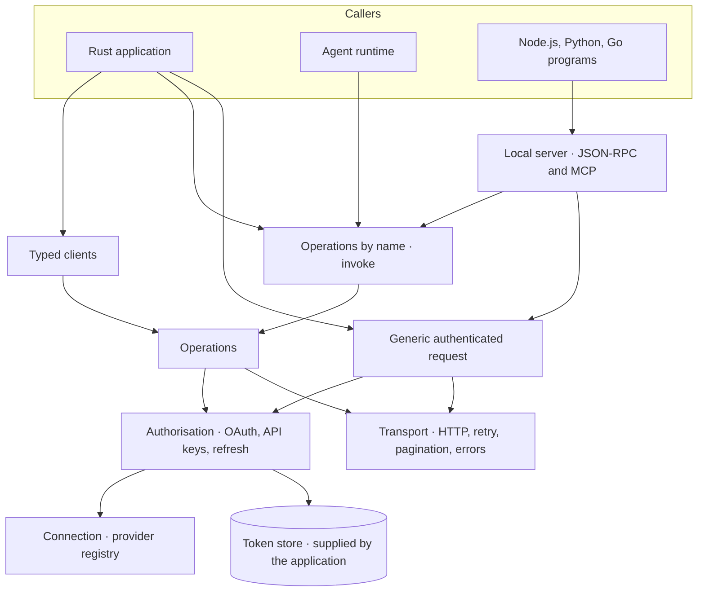
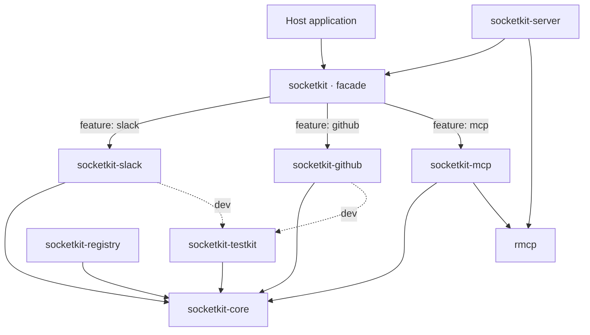
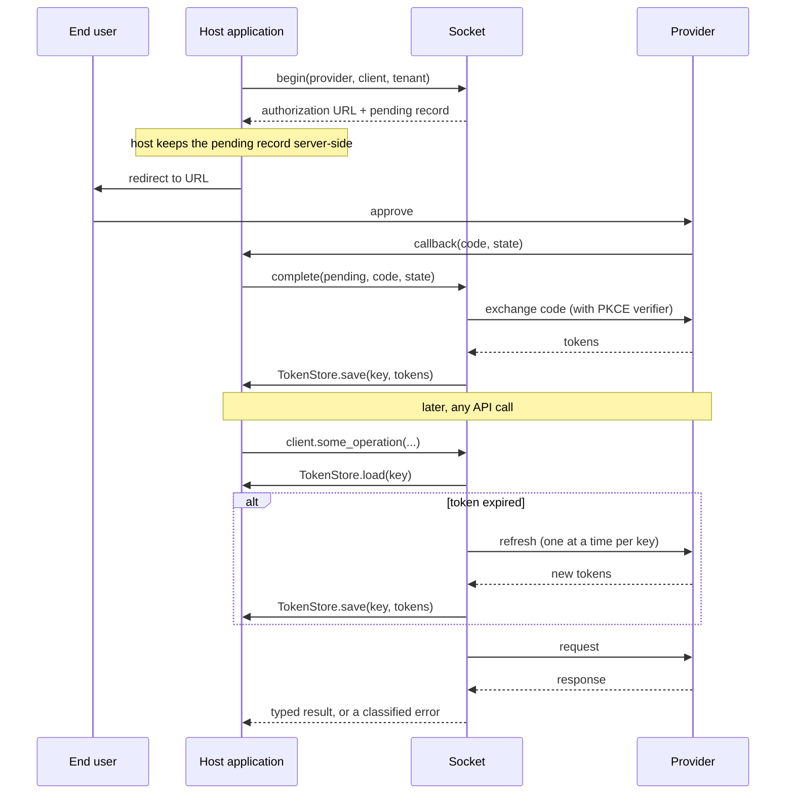
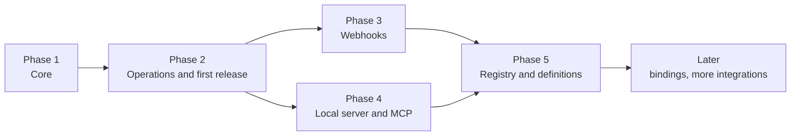

# Socket — project design

**Status:** Draft for review
**Date:** 2026-10-08
**Owner:** Vasanth
**Scope of this document:** the whole project: architecture, the core's design, the contract every integration follows, how other languages are reached, and the phases. Each phase gets its own detailed spec and implementation plan before work on it starts. Phase 1 is the first.

Read [the vision](../../vision.md) first for why the project exists. The evidence behind the choices here is in two research reports, [validation and FFI](../../research/2026-10-08-integration-library-validation-and-ffi.md) and [the earlier landscape survey](../../research/2026-10-08-integrations-library-landscape.md). Figures quoted below come from them and are dated 2026-10-08. Where the two disagree, the validation report is the later and corrects the survey.

---

## 1. Summary

Socket is an open-source library that gives a product the layers it needs to connect to external services: a registry that describes each service, an authorisation layer that runs OAuth and keeps tokens fresh, and the operations for each service. The application owns its OAuth apps and its token storage. Nothing is hosted.

It is written in Rust as a Cargo workspace: a small core, one crate per integration, and a facade crate whose features switch integrations on. Every operation is a typed Rust method and is also callable by name with JSON. That second form is what agents, MCP and other languages use, and it is part of the core from the first phase.

Socket is a standalone project. Existing code can seed its core (appendix A), but the design below does not depend on where that code came from.

## 2. Goals and non-goals

### Goals

| # | Goal | How we know it is met |
| --- | --- | --- |
| G1 | A Rust application enables a service with one feature flag and gets a typed client | The quickstart example compiles in CI and makes an authenticated call in about thirty lines, given a token or API key |
| G2 | The application owns credentials | No library crate reads an environment variable, writes a file, or contacts a Socket-operated host |
| G3 | One implementation serves every caller | Every operation is callable as a typed method and by name with JSON, and describes itself with a schema |
| G4 | Adding an integration does not change the core | The fourth integration is added by touching only its own crate, one facade line and one docs row |
| G5 | What is listed as verified works | Every tier-one integration passes live tests on a schedule, or is demoted |
| G6 | The core can be used from another language | A program with no Rust in it completes an OAuth connection and invokes an operation through the local server (phase 4) |
| G7 | A service is usable before anyone writes operations for it | Any provider in the registry can be authorised and called through the generic request, with no integration crate |

### Non-goals

- **Thousands of hand-maintained integrations.** No measured catalogue sustains that. Breadth comes from the registry, the generic request, operation definitions and MCP (section 9).
- **A unified data model across vendors.** No shared `Ticket` or `Message` type. Each integration keeps its vendor's shapes.
- **A hosted service** of any kind, including an OAuth callback proxy.
- **Workflow execution, agent loops, or LLM clients.**
- **A sync engine.** Pagination is in scope. Incremental sync with stored cursors, change data capture and backfills are not, for now.
- **Runtime abstraction.** Socket targets Tokio and `reqwest`. It does not abstract over async runtimes.
- **Other languages in the first phase.** Supporting other languages is a goal (G6). Phase 1 is Rust only, and it must work there first. Other languages follow through the local server, then in-process bindings (section 8).
- **Adoption by existing workflow platforms.** n8n and its peers treat their catalogues as their product and none has adopted another project's connectors. They illustrate the problem; they are not the target user.

## 3. What exists today

No maintained project combines a permissive licence, in-process execution, application-owned token storage, a built-in OAuth flow, typed operations, webhooks and reach into other languages. Each property exists somewhere.

| Project | What it has | What it lacks against this design |
| --- | --- | --- |
| Corsair (TypeScript, Apache-2.0) | Typed operations, webhooks and the OAuth lifecycle in-process; 358 packages | Requires its own tables in the application's database; recommends a hosted hub for OAuth; TypeScript only |
| `amp-labs/connectors` (Go, MIT) | In-process calls with tokens supplied by the application; 251 providers; generic read and write | The OAuth authorisation flow, which its hosted platform provides; unit operations; tagged releases |
| Activepieces pieces (TypeScript, MIT) | 736 pieces, published as bundles that run outside the Activepieces engine | OAuth, refresh and trigger lifecycle; a non-Node product must run them in a second process |
| Hosted platforms | Thousands of listed integrations | They hold the tokens |
| Superface OneSDK (Rust core compiled to WebAssembly, MIT) | The same delivery idea: a Rust core used from Node.js and Python | Any connection or OAuth lifecycle; releases since January 2025 |

Two lessons from this shape the design. The auth and connection layer is the part with the longest life: Spring Security absorbed Spring Social's connection framework while the per-service bindings beside it were dropped. And the nearest substitute a team reaches for today is not a hosted vendor but someone else's connectors run in a sidecar, so Socket must be better than that on custody, refresh and webhooks for a small set of services before breadth matters.

## 4. Architecture

### 4.1 Layers



Each layer is usable without the ones above it. An application can take the registry and the authorisation layer and make its own calls through the generic request.

### 4.2 Workspace layout

```
socket/
├── Cargo.toml                  # workspace; shared version, lints, dependencies
├── crates/
│   ├── core/                   # socketkit-core
│   ├── facade/                 # socketkit         (features switch integrations on)
│   ├── integrations/
│   │   ├── github/             # socketkit-github
│   │   ├── slack/              # socketkit-slack
│   │   ├── linear/             # socketkit-linear
│   │   ├── notion/             # socketkit-notion
│   │   ├── google/             # socketkit-google  (Drive, Docs, Meet as modules)
│   │   └── zoom/               # socketkit-zoom
│   ├── registry/               # socketkit-registry (provider definitions as data, phase 5)
│   ├── server/                 # socketkit-server   (local process: JSON-RPC and MCP, phase 4)
│   ├── mcp/                    # socketkit-mcp      (client for remote MCP servers, phase 4)
│   └── testkit/                # socketkit-testkit  (wire-test server, conformance suite)
├── bindings/                   # in-process bindings, added on demand (section 8.3)
├── examples/
└── docs/
```

One crate per vendor, not per product: the vendor is the auth boundary. Google's products share one OAuth provider, so they are modules of `socketkit-google` behind that crate's own features.

`socketkit` is a working crate prefix. The name `socket` is taken on crates.io. See section 13.

### 4.3 Dependency rules



The rules, which CI enforces:

1. `socketkit-core` depends on no other workspace crate.
2. An integration crate depends on `socketkit-core` only. Integration crates never depend on each other.
3. The facade contains no logic. It re-exports the core and, behind features, the integration crates.
4. Nothing in the workspace depends on a consuming product or on an agent framework. Adapters for a framework are separate crates that depend on Socket (section 8.4).
5. `socketkit-mcp` and `socketkit-server` wrap `rmcp` and never re-export its types. `rmcp` shipped three major versions in 2026.

### 4.4 The facade

For a Rust user the experience is `features = ["slack", "github"]`. Each feature is only a dependency switch:

```toml
# crates/facade/Cargo.toml (shape)
[features]
default = []
github = ["dep:socketkit-github"]
slack  = ["dep:socketkit-slack"]
```

There is no `full` feature. crates.io caps a crate at 300 features and a single feature at 300 entries, and a catch-all feature invites builds that compile everything.

Feature selection is a Rust convenience and does not carry over to other languages. Nobody ships Cargo-style selection to npm, PyPI or Maven users; the local server and any binding ship with a fixed set of integrations (section 8).

### 4.5 Why not one crate with a feature per integration

That model is not blocked at a small size. The reasons to split from the start:

- **It only gets more expensive.** Apache OpenDAL ran the single-crate model to about 65 services, then split into a core, per-service crates and a facade (RFC November 2025, shipped May 2026). `sqlx` split late and lost trait implementations that could not exist across crate boundaries.
- **Semver.** In one crate, a breaking change in one vendor's client forces a major version on everyone.
- **Ownership.** Tiering, archiving and assigning an owner are simple per crate and awkward per `#[cfg]` block.
- **Size in other languages.** A packaged server or binding carries every integration it was built with. Thin integration crates over one shared HTTP client keep that small.

## 5. Core design (`socketkit-core`)

The core is plumbing. It knows nothing about any specific service.

Code in this section shows the intended shape. Exact signatures are settled in the phase 1 spec.

### 5.1 Providers and the registry

A provider is the description of a service's identity and auth: plain data with a small number of hooks for quirks.

```rust
pub struct ProviderSpec {
    pub id: ProviderId,                // "slack"
    pub display_name: String,          // "Slack"
    pub api_base: Url,                 // overridable for self-hosted instances
    pub allowed_hosts: Vec<String>,    // the only hosts that may receive this provider's credentials
    pub auth: AuthScheme,
}

pub enum AuthScheme {
    OAuth2(OAuth2Spec),                // endpoints, default scopes, separator, client auth style, PKCE support
    ApiKey(ApiKeySpec),                // where the key goes: header, query, or basic auth
}
```

Two hooks cover what data cannot:

- **Token response parsing.** Slack nests the user token under `authed_user`; Notion and GitHub add fields. Default handles the standard shape.
- **Response classification.** Slack reports errors inside HTTP 200. GitHub throttles with a 403 marked by a quota header. The provider tells the core which responses are throttling, refusal, or failure.

`ProviderSpec` is serialisable from the first phase. That is what lets the registry (section 9) hold definitions for far more services than have integration crates: a provider that needs neither hook is a data file. Two existing catalogues show the scale this reaches and are under licences that allow reuse: Grant's 218 entries and Ampersand's 251, both MIT.

### 5.2 Credentials and token storage

The application supplies both ends.

```rust
pub struct OAuthClient {            // the application's own OAuth app
    pub client_id: String,
    pub client_secret: SecretString,
    pub redirect_uri: Url,
}

pub struct ConnectionKey {          // which stored authorization
    pub provider: ProviderId,
    pub tenant: String,             // opaque to Socket: a user id, a workspace id
}

#[async_trait]
pub trait TokenStore: Send + Sync {
    async fn load(&self, key: ConnectionKey) -> Result<Option<TokenSet>>;
    async fn save(&self, key: ConnectionKey, tokens: TokenSet) -> Result<()>;
    async fn delete(&self, key: ConnectionKey) -> Result<()>;
}
```

- The store is held as `Arc<dyn TokenStore>`. Its methods take owned values and return `Result`, so the same trait can be implemented by an object in another language (section 5.9). Two production SDKs use this pattern for the same job: Bitwarden's client-managed tokens and the Matrix SDK's session delegate.
- Socket ships one implementation, `MemoryTokenStore`, for command-line tools and examples. Database-backed stores belong to the application.
- Secrets use a wrapper type that does not print in `Debug` or `Display`. A test asserts this for every type that holds one.
- Encryption at rest is the store's job. Socket does not encrypt, because it does not persist.

### 5.3 The OAuth flow



Requirements:

- **The host owns the callback route.** Socket builds the URL and completes the exchange; it never listens on a port.
- **State is signed and expires** (HMAC-SHA256, ten minutes). The PKCE verifier travels in a pending record the host keeps server-side, never in the URL.
- **Refresh is single-flight per `ConnectionKey`.** Two concurrent calls with an expired token cause one refresh. Providers that rotate refresh tokens invalidate the old one on use, so a second refresh would break the connection. Single-flight is a per-connection async lock held across the store's load and save for that connection, so a caller that waited re-reads what the caller before it saved. A store must not call back into Socket for the same connection from inside those methods. If a save fails after a successful refresh, the rotated token is kept in memory and saved on the next call, so it is not lost.
- **The token endpoint's failures are told apart.** A declined code or refresh token means reconnect. Throttling is reported as throttling, and a rejected client id or secret as a configuration error, so that neither tells every user to reconnect.
- **The pending record belongs to the session that started the flow.** The application must look it up by that session at the callback, not by the `state` in the URL, and delete it after one use. Socket cannot enforce this, because only the application knows who is asking.
- **A rejected refresh is reported as "reconnect required"**, distinct from a transient failure.

This lifecycle is the part of Socket with no library equivalent elsewhere: the login catalogues return a token and stop, and the projects that do refresh in-process dictate the application's database schema.

### 5.4 Transport

One HTTP path for every integration:

- A single `reqwest::Client`, built once. An application may supply a client builder with its own proxies, timeouts and certificates; Socket builds the client from it so that redirect-following is always off. TLS through `rustls`.
- **Host allowlist.** Credentials are attached only to requests over https, on port 443, whose host is in the provider's `allowed_hosts`. The OAuth token endpoint must be one of those hosts too, because it receives the client secret and refresh tokens. The one exception is plain http to a loopback address listed with its port, for tests and local development. A bug or a malicious change in an integration crate cannot send a token elsewhere.
- **Nothing a caller supplies can move or replace the credentials.** Redirects are never followed. A caller cannot set the headers that carry credentials or choose a host outside the provider's `allowed_hosts`, cannot repeat the API key's query parameter under any spelling, and cannot put a username or password in the URL. A provider's error text is shortened and has the credential removed before it reaches an error message.
- **Bounded waiting and reading.** The default client times out after 30 seconds, and a response larger than 10 MB is refused.
- **Retry** with backoff for retryable failures, honouring `Retry-After`. Non-idempotent requests are retried only when the provider's classifier says the request was not processed.
- **Pagination** as one model: a call takes an optional cursor and returns a `Page<T>` with the next cursor. A stream adapter sits above that for Rust callers. Each integration maps its vendor's style (cursor, `Link` header, GraphQL `pageInfo`) onto it.
- GraphQL is a first-class request shape, not an afterthought on a REST helper. Linear is GraphQL-only.
- **A generic authenticated request.** The application names a connection, a method, a path and a body, and gets the response with auth, the allowlist, retry and error classification applied. This is what makes a registry-only provider usable (G7), and it is what users of every large catalogue fall back on: in n8n's public templates the plain HTTP request node appears more often than any single integration.

### 5.5 Errors

```rust
pub struct Error {
    kind: ErrorKind,
    provider: Option<ProviderId>,
    retry: Retry,                    // Never | After(Duration) | Later
    message: String,                 // safe to show to an end user
    source: Option<Box<dyn std::error::Error + Send + Sync>>,
}

#[non_exhaustive]
pub enum ErrorKind {
    ReconnectRequired,   // the provider rejected the stored authorization
    AccessDenied,        // known caller, refused: policy, missing scope
    NotFound,
    RateLimited,
    InvalidInput,
    Unsupported,         // this integration does not offer the operation
    Config,              // the application set something up wrong
    Transport,
    Decode,
    Unexpected,
}
```

Rules:

- Each kind has a stable string code. An error serialises as code, provider, retry guidance and message, so it reads the same to a Rust caller, over the local server, and through a binding. `source` stays on the Rust side.
- `ReconnectRequired` and `RateLimited` messages carry the provider name only, never a response body.
- `AccessDenied` carries the provider's own explanation verbatim, because it is the only place the reason is stated.
- A 200 response that is not valid for the operation is an error, never a success.

### 5.6 Operations

An operation is one unit function of a service. It exists once and is reachable two ways.

```rust
pub struct OperationInfo {
    pub name: String,                   // "slack.chat.post_message"
    pub description: String,
    pub input_schema: serde_json::Value,
    pub output_schema: serde_json::Value,
    pub effect: Effect,                 // Read | Write | Destructive
    pub required_scopes: Vec<String>,
}

#[async_trait]
pub trait Integration: Send + Sync {
    fn provider(&self) -> ProviderSpec;
    fn operations(&self) -> Vec<OperationInfo>;
    async fn invoke(&self, conn: Connection, operation: String, input: serde_json::Value)
        -> Result<serde_json::Value>;
}

impl Socket {                           // the handle an application builds once
    pub fn operations(&self) -> Vec<OperationInfo>;
    pub async fn invoke(&self, key: ConnectionKey, operation: String, input: serde_json::Value)
        -> Result<serde_json::Value>;
    pub async fn request(&self, key: ConnectionKey, request: RawRequest) -> Result<RawResponse>;
}
```

- **By name.** `Socket::invoke` takes a connection, an operation name and JSON, and returns JSON. `Socket::operations` lists what is available. This is the layer agents, the local server, MCP and bindings use.
- **Typed.** Each integration crate also exposes a client with one method per operation, for example `slack.chat().post_message(...)`. The typed method and the named operation run the same code; the input and output types derive `serde` and their schemas.

The by-name layer is in the core from phase 1 and is not optional. Every project that reached five or more languages from a Rust core did it through a narrow surface of this kind (1Password's `Invoke`, Bitwarden's `run_command`, Temporal's protobuf messages), and none exposes hundreds of typed per-vendor classes across languages. If typed clients were the only layer, every binding would multiply by every integration.

`effect` and `required_scopes` exist so a host can require approval for writes, or refuse a call before a run starts when the connection lacks a scope. Names and schemas are owned strings and values, not static ones, so operations loaded from definitions (section 9) are described the same way as compiled ones.

### 5.7 Identity and resolution

Two small capabilities every integration offers, both exposed as ordinary operations:

| Capability | Purpose | Phase |
| --- | --- | --- |
| `Identity` | "Whose token is this, and does it still work?" Returns the account behind a connection. | 1 |
| `Resolve` | Turn something a person typed (a repo name, a channel, a URL) into a confirmed resource. | 1 |

There are no cross-vendor business traits.

### 5.8 Webhooks (phase 3)

The core provides signature verification and replay-window checks. Each integration provides its signing scheme and typed event types. The host owns the HTTP route and passes raw headers and body in.

### 5.9 Rules that keep the core usable from other languages

Bindings and the local server come later, but these rules apply from the first commit, because retrofitting any of them means redesigning the public API.

1. **Everything is reachable by name with plain data** (section 5.6). Public input and output types have no lifetimes or generics and derive `serde`.
2. **Interfaces the application implements are object-safe traits** held as `Arc<dyn Trait>`, `Send + Sync`, with owned parameters and `Result` returns. No `impl Trait` parameters for the token store or any other hook.
3. **No ambient runtime.** The core runs on a Tokio runtime handle it is given or creates. It never assumes it is being called from inside one.
4. **The store may be slow and bound to a thread the host owns.** The core holds no thread lock while calling it. The one lock it does hold is the async per-connection refresh lock (section 5.3), so a store must not call back into Socket for the same connection.
5. **Pagination is cursor in, page out** at the lowest public layer. Streams are a convenience above it.
6. **Dropping a call cancels it.** The core starts no detached background work.
7. **Errors are flat and serialisable** (section 5.5).

## 6. The integration crate contract

Every integration crate has the same layout, so a reader who knows one knows all of them.

```
crates/integrations/slack/
├── Cargo.toml          # name, tier and owner in [package.metadata.socketkit]
├── src/
│   ├── lib.rs          # re-exports only
│   ├── provider.rs     # ProviderSpec, token-response parser, response classifier
│   ├── client/         # the typed client, one file per area of the API, re-exported from mod.rs
│   ├── models/         # request and response types, one file per area, re-exported from mod.rs
│   ├── resolve.rs      # Resolve implementation
│   ├── operations.rs   # descriptors and dispatch for invoke
│   └── webhook.rs      # when the service sends events
└── tests/
    ├── wire.rs         # against the local test server; always runs
    └── live.rs         # against the real service; runs in the live CI job
```

An integration crate must:

1. Provide a `ProviderSpec` with an explicit host allowlist.
2. Implement `Integration`, including `Identity`. Implement `Resolve` where it applies, and return `Unsupported` where an operation does not.
3. Register every typed method as a named operation with input and output schemas.
4. Make all requests through the core transport. No direct `reqwest` use.
5. Read no environment variables, touch no files, spawn no processes, and contain no `unsafe`.
6. Pass the shared conformance suite (section 7).
7. Declare a tier and a named owner.

## 7. Testing

Three levels. None of them may pass by skipping.

| Level | Runs against | When | Covers |
| --- | --- | --- | --- |
| **Unit** | Nothing external | Every commit | Parsing, classification, signing, state expiry |
| **Wire** | A local HTTP server in `socketkit-testkit` that replays provider responses | Every commit | The full request path: auth header, pagination, error mapping, retries |
| **Live** | The real service, with test-account credentials held as CI secrets | On a schedule and before release, per integration | That the provider still behaves as the wire fixtures say |

**Conformance suite.** `socketkit-testkit` holds tests every integration runs, selected by the capabilities it declares: an expired token yields `ReconnectRequired`; throttling yields `RateLimited` with retry guidance; pagination terminates; a request to a host outside the allowlist is refused; secrets do not appear in debug output; every typed method has a named operation whose schema matches its types.

**Live tests fail when credentials are missing.** A live job that cannot authenticate is red, not skipped. OpenDAL's shared suite skips silently without credentials and only 47 of its 68 services have CI setups; Socket does not repeat that.

**Fixtures carry a date.** Wire fixtures are recorded from the real service and scrubbed. An integration with no live job says so in its tier and shows when its fixtures were last recorded. A fixture proves the integration matched the service on that day and nothing later.

**Live accounts are the scarce input.** A live job needs a working account for the service, and for some services a paid one. Each tier-one integration names who supplies its test account.

**Feature combinations.** CI builds the facade with each feature alone (`cargo hack --each-feature`) so a feature that only compiles alongside another is caught.

## 8. Agents, the local server and other languages

All three use the by-name layer (section 5.6). None of them adds integration code.

### 8.1 Agent tools

An agent runtime reads `OperationInfo` and calls `invoke`. `effect` tells it which calls to gate behind approval. No separate tool definitions are written.

### 8.2 The local server (phase 4)

`socketkit-server` is a process the application runs on the same machine. It exposes the by-name layer over two protocols:

- **JSON-RPC over stdio**, for a program in any language: begin and complete an OAuth connection, list operations, invoke one, make a generic request.
- **MCP**, so the same operations appear as tools to any MCP client.

This is the first way to reach other languages because it is the cheapest: one executable per platform serves every language, and the client in each language is thin enough to generate from the operation schemas. Delta Chat exposes one JSON-RPC API both over stdio and in-process for the same reason.

Its cost is custody. Either the server holds the tokens, or the protocol carries token-store calls back to the host program. The second keeps principle 1 intact and is the assumed design: the server asks the host to load and save tokens over the same connection. No project was found doing this over a JSON protocol, so it is designed in the phase 4 spec, not copied.

### 8.3 In-process bindings

A binding loads the core into the host program's process. Bindings are a committed part of the project and are added one language at a time after the local server, starting with Node.js through `napi-rs` and Python through PyO3, where the tooling is most mature.

What a binding costs, so the decision is made with open eyes:

- No single tool covers the likely languages. Each needs its own bridge: `napi-rs`, PyO3, JNI, UniFFI for Kotlin and Swift, a C interface for Go and .NET.
- Each ships prebuilt binaries per operating system, architecture and C library: about eight targets for Node.js and seven to nine wheels for Python, each with its own release pipeline.
- A binding carries a fixed set of integrations, chosen at build time by the maintainers.
- Two projects moved away from this architecture. Prisma cited the binaries, edge runtimes and contributor friction. Infisical replaced a cross-language Rust SDK with plain per-language ones when the shared part was only authenticated HTTP calls.

The Infisical case sets the test for Socket: a binding is worth building only for the logic that is hard to get right twice, which is the auth lifecycle, refresh, retry, pagination and webhook verification. That is the core. It is not the individual operations.

### 8.4 Framework adapters

An adapter maps Socket's operations onto a framework's own tool interface. Adapters are separate crates that depend on Socket and are not part of the phases below. See decision 9 in section 13.

## 9. Breadth

"An integration" means different things at different depths, and Socket says which depth a service is at.

| Layer | What it gives | How it grows | Phase |
| --- | --- | --- | --- |
| **Registry** | A provider definition: enough to authorise a user and keep the token fresh | Data files in `socketkit-registry`, contributed and reviewed like any change | 1 for six providers; 5 for the catalogue |
| **Generic request** | Any endpoint of a registered provider, with auth, retry and error classification | Nothing to add per service | 1 |
| **Verified integrations** | Typed operations, webhooks, an owner, live tests | One crate at a time, when an owner appears | 2 onwards |
| **Operation definitions and a verifier** | Operations described as data, interpreted by the core, checked against the real API | By the team that needs the operation, or its coding agent | 5 |
| **MCP client** | Tools from any vendor's remote MCP server, using the same token store | Whatever vendors publish | 4 |

**Why layers.** Headline counts in large catalogues overstate what works. In Pipedream's repository 1,266 of 3,401 app directories hold only an auth definition. Airbyte labels 507 of 589 sources alpha and certifies 81 connectors after six years. Usage is concentrated too: every certified Airbyte source is high-usage, and only 133 of 589 are. The honest size of a catalogue is its verified tier, and a design that admits this can still be useful for the other services through the first two layers.

**No fixed size.** The catalogue has no target count. The first hundred services, and the order they are added, are listed in [the catalogue](../../catalogue.md).

**Registry.** Auth is the part that describes well as data. One catalogue expresses about 1,046 providers with roughly ten auth modes, four of which cover about 87% of entries. Phase 1 ships six providers and keeps `ProviderSpec` serialisable; the catalogue itself is phase 5.

**Operation definitions and the verifier.** Writing a first version of an operation is now nearly free: one vendor reports about 200 generated in fifteen minutes for under twenty dollars. Knowing it works is not, and every pipeline that produces usable ones tests against a real connection. Socket's contribution to the long tail is therefore the substrate, not the operations: a format for describing an operation, an interpreter in the core, and a verifier that runs a definition against a real connection and records the result. A definition can be loaded without recompiling, which also suits the local server and bindings.

What is known about the limits: writes can be declared (n8n and Zapier both do it in production), but adoption stays low even where it is the default (about 28 of n8n's 308 node directories), and webhook payload handling is code everywhere. So the format needs an escape hatch for what data cannot express. Whether that is an expression language, an embedded script engine or WebAssembly is the main open design question of phase 5. No Rust project interprets a cross-vendor operation catalogue at runtime today, so this layer has no precedent to copy.

**What can be reused.** Most existing catalogues cannot be translated into Socket: n8n's, Pipedream's and Nango's licences forbid it. Three inputs are permissive: Activepieces' community pieces (MIT), the provider catalogues from Grant and Ampersand (MIT), and most vendor OpenAPI documents. OpenAPI covers request and response shapes for many services, but not pagination, rate limits or webhooks, and one measurement found most production APIs drifting from their published document. It is a source for definitions, not a guarantee of quality.

**MCP.** `socketkit-mcp` is a client for remote MCP servers. Remote tools appear as operations, and OAuth tokens for MCP servers go through the same `TokenStore`. MCP is complementary: the 2026-07-28 revision has no webhook or events primitive, no typed operations, and no answer for where a multi-tenant backend stores tokens. Every workflow platform has adopted it as the answer to "we lack a connector for X", so Socket ships it in both directions (client here, server in section 8.2) instead of competing with it.

## 10. Governance

Published with the first release, not added after the catalogue grows.

| Tier | Meaning | Requirements |
| --- | --- | --- |
| **1 — Verified** | Covered by the project's semver promise | Named owner; wire and live tests in CI; live job green within the last 30 days; a named source for the test account |
| **2 — Community** | Best effort | Named owner; wire tests in CI; date of last fixture recording shown |
| **Registry** | Authorisation and generic request only | A provider definition that passes the registry's checks; no operations |
| **Archived** | No longer in the facade | Crate marked deprecated on crates.io with a pointer to the last working version |

- An integration with no owner for 90 days, or a red live job for 30, drops a tier.
- Tier and owner live in each crate's `Cargo.toml` metadata; the README table is generated from it.
- **Security review for every contributed integration.** Integration code runs in-process with decrypted tokens. In January 2026 malicious community packages for a workflow platform were caught stealing OAuth tokens. The host allowlist narrows what a bad integration can do; review is still required.
- **Bring your own credentials, always.** No OAuth client ID or secret is ever committed. Google's API terms forbid embedding developer credentials in open-source projects, and other vendors have similar terms. Each new integration's pull request records that the vendor's API terms were checked.
- **No stubs are published.** An integration that does not work is not in the facade.
- **Neutrality.** There is no hosted Socket product and no feature is held back for one. Every earlier project of this shape was the open edge of a company's hosted service and stopped when the company moved on. How a project without that sponsor funds its verified tier is unsolved (section 14).

## 11. Packaging and versioning

| Item | Decision |
| --- | --- |
| Edition and minimum Rust | Edition 2024, `rust-version = "1.85"`. Raised only in a minor release. |
| Versioning | All crates share one version and release together while the core is 0.x. Independent versions are reconsidered at core 1.0. |
| Async | Tokio. `async-trait` for object-safe traits such as `TokenStore` and `Integration`. |
| HTTP and TLS | `reqwest` with `rustls`. |
| Unsafe | `#![forbid(unsafe_code)]` in every library crate. A binding crate is the only place it may be allowed, and only at the boundary. |
| Supply chain | `cargo-deny` in CI for licences and advisories. |
| Dates and times | The core's public API uses `std::time` only. The type used in integration models is chosen in the phase 2 spec, when the first models are written. |
| Feature and operation names | `slack`, `github` and operation names such as `slack.chat.post_message` are permanent public API once published. They are fixed in the phase 2 spec before release. |

## 12. Phases

Each phase ends with something that works and is verified in a real consumer. The reference consumer is the product described in appendix A; an example application in this repository covers anything it does not exercise.



### Phase 1 — Core

**Build:** the workspace; `socketkit-core` (providers as data, OAuth with PKCE, token store, single-flight refresh, transport with allowlist and retry, pagination, the generic request, errors, the operation registry and `invoke`); `socketkit-testkit`; six integration crates (GitHub, Slack, Linear, Notion, Google, Zoom) each with a provider definition, `Identity` and `Resolve`; the facade; CI.

**Does not include:** operations beyond identity and resolution, webhooks, the local server, publishing.

**Done when:**

- The reference consumer runs OAuth connect, token refresh and resource resolution on Socket against the real providers.
- An example program lists operations and invokes one by name with JSON, with no typed call.
- The generic request reaches an endpoint of each of the six providers.
- The conformance suite passes for all six.
- The rules in section 5.9 are checked in review and, where possible, by a test.

### Phase 2 — Operations and first release

**Build:** typed operations for GitHub, Slack and Linear (REST, REST-with-quirks and GraphQL, so the core is proven against three styles before anything is published), each registered by name; governance documents; live CI jobs.

The operation list for each of the three is set in the phase 2 spec. It is deliberately short.

**Done when:**

- A real workflow in the reference consumer completes a tool call against each of the three services through `invoke`.
- Version 0.1.0 of the core, the facade and the tier-one integrations is on crates.io.

### Phase 3 — Webhooks

**Build:** verification in the core; typed events for GitHub, Slack and Linear.

**Done when:** a real event from each is received and verified, and a tampered or replayed payload is rejected in tests.

### Phase 4 — Local server and MCP

**Build:** `socketkit-server` (JSON-RPC over stdio and an MCP server) and `socketkit-mcp` (client for remote MCP servers) with the facade's `mcp` feature.

**Done when:**

- A Node.js or Python program with no Rust in it completes an OAuth connection and invokes an operation through the server, with tokens stored by that program.
- An MCP client lists and calls Socket operations.
- An application lists and calls tools on one vendor's official remote MCP server, authenticated through its own `TokenStore`.

### Phase 5 — Registry and definitions

**Build:** `socketkit-registry` with provider definitions as data; the operation definition format, its interpreter and the verifier.

**Done when:**

- A provider added as a data file can be authorised and called through the generic request with no code change.
- An operation that Socket does not ship is added as a definition, verified against the real service, and invoked by name.
- A product replaces a second-runtime integration layer with Socket for ten services. This is the test of whether Socket beats the substitute teams use today.

### Later, not scheduled

- In-process bindings, one language at a time, starting with Node.js and Python (section 8.3).
- Further verified integrations, as owners appear.
- Incremental sync.

## 13. Decisions to confirm

These are yours to make. The document assumes the first option in each.

| # | Decision | Assumed | Alternative |
| --- | --- | --- | --- |
| 1 | **Who Socket is for.** | Teams building new products that need integrations: engines, agent products, self-hosted software, Rust backends. n8n is the example of the problem. | Aim at existing workflow platforms. The research found no platform that has adopted another project's connectors, and Node.js platforms cannot easily load a Rust core. |
| 2 | **The breadth claim.** Decided 2026-10-08: no fixed size; start from the top hundred. | "The hundred most-integrated services first, then as many as the registry and definitions reach; each service states its tier." | "Thousands of integrations." No measured catalogue sustains this, and it would be read with scepticism. |
| 3 | **How other languages are reached.** Decided 2026-10-08: other languages are supported, and Rust comes first. | Local server next, then in-process bindings one language at a time. | In-process bindings before the local server. Each is a separate build and release pipeline, and two projects backed out of this. |
| 4 | **Starting code.** | Seed phase 1 from the existing OAuth and resolution code (appendix A). | Start from a blank workspace and use that code as reference only. |
| 5 | **Crate prefix.** `socket` (a 2015 networking crate) and `sockets` are taken on crates.io. `socketkit`, `socketkit-core` and `socketkit-slack` were unregistered on 2026-10-08. | `socketkit` | Another name. "Socket" reads as network sockets to Rust developers, and Socket is also the name of a software supply-chain security company. |
| 6 | **Licence.** | `MIT OR Apache-2.0`, the Rust ecosystem's usual pair | MIT only |
| 7 | **Repository owner.** The folder sits under `0xteamhq`. | `github.com/0xteamhq/socket` | A personal account |
| 8 | **First public release.** | After phase 2, when there are typed operations to show | After phase 1, as an auth-and-plumbing library. The research suggests the auth layer is the durable part, so this is a real option. |
| 9 | **Framework adapters.** | None in the phases. An adapter for an agent framework is a separate crate, added when a consumer needs it. | Ship one adapter in this repository with phase 2. |

## 14. Risks

| Risk | Why it is real | Response |
| --- | --- | --- |
| **The operations layer** | Spring Social, Trigger.dev and LangChain each dropped shared per-service bindings and said the upkeep was not worth it. | A small verified set; everything else behind definitions and a verifier; the auth layer useful alone. |
| **A core too thin to justify bindings** | Infisical replaced a cross-language Rust SDK with plain per-language ones. | Keep the hard logic in the core. Reach other languages through the local server first. Add a binding only on demand. |
| **The wrong consumer** | Existing platforms will not adopt. Nobody was found asking for this by name. Buyers with budgets choose hosted catalogues. | Aim at new products and self-hosted software. The phase 5 replacement test measures whether the need is real. |
| **Accounts for live testing** | Verification needs a working account per service; some are paid or gated. Pipedream's backlog is tagged with exactly these blockers. | Named account source per tier-one integration. Dated fixtures for the rest. |
| **No sponsor** | Every earlier attempt was funded by a hosted product. | Per-crate ownership so one integration can change hands. Otherwise unsolved. |
| **Agents and MCP reduce the need** | LangChain said coding agents and MCP make a shared package less necessary. | Build what agents write against: registry, authenticated client, verifier. Ship MCP in both directions. |
| **Core API needs redesign after release** | `sqlx` lost trait implementations when it split crates. | Three API styles before 0.1; the rules in section 5.9 from the first commit; lockstep 0.x versions. |
| **Handling other people's tokens** | A flaw leaks credentials for every user of an application. | Host allowlist, secret types that do not print, no persistence in the library, security review of contributions. |
| **Naming confusion** | Decision 5. | Settle before the first publish; names are hard to change after. |

## 15. Open questions for later specs

Recorded so they are not lost, and each is assigned to the spec that must answer it.

| Question | Answered in |
| --- | --- |
| Exact trait signatures and module layout of the core | Phase 1 spec |
| Whether to keep a hand-written OAuth flow or adopt the `oauth2` crate | Phase 1 spec |
| How schemas are produced for operation inputs and outputs, and what that costs in compile time | Phase 1 spec |
| What OpenConnector (Apache-2.0, an auth gateway claiming 1,500 providers) does and whether its provider data is reusable. The research did not examine it. | Phase 1 spec |
| The operation list per integration and the timestamp type in models | Phase 2 spec |
| Whether typed clients are hand-written throughout or sit on a generated low-level layer where a vendor publishes a spec | Phase 2 spec |
| The protocol by which the local server asks the host to load and save tokens | Phase 4 spec |
| Whether vendor MCP servers support service-account auth for backend use | Phase 4 spec |
| The operation definition format, and its escape hatch for what data cannot express | Phase 5 spec |
| How the verifier runs without exposing the tokens it tests with | Phase 5 spec |

## Appendix A. Existing code that can seed phase 1

A private product by the same author, stev, has a `connector` crate of 6,938 lines. Part of it is general plumbing and part is specific to that product. This appendix records which is which, so phase 1 can start from the first part if decision 4 stands. Nothing else in this document depends on it.

| Part | Lines | Tests | In use | What it is |
| --- | --- | --- | --- | --- |
| `oauth/` | 911 | 4 | Yes | Provider definitions for GitHub, Google, Linear, Notion, Slack and Zoom; signed state; code exchange; refresh |
| `resource/` | 1,196 | 41 | Yes | Checks that a repository, channel, team or document exists and the account can reach it; rate-limit and refusal classification |
| `providers/` | 4,200 | 0 | No | 18 connectors implementing product-specific roles |
| `traits/`, `types.rs`, `registry.rs`, `error.rs`, `lib.rs` | 631 | 0 | Error type only | Role traits, product domain types, a registry |

The tested, used half is general. Socket takes that half; the rest stays where it is.

### What would move

- The OAuth flow, signed state and the six provider definitions.
- Resource resolution for the six providers, with its tests.
- The error distinctions: token rejected, rate limited, access denied, not found.
- The HTTP helper that tells throttling from refusal.

### What changes on the way

| In the existing code | In Socket | Reason |
| --- | --- | --- |
| The client ID is read from an environment variable inside the library | The application passes an `OAuthClient` value | A library must not read the environment; a multi-tenant host may hold many OAuth apps |
| Endpoint URLs are `&'static str` | Owned, serialisable values with an overridable base URL | Self-hosted instances; providers loaded from data |
| The provider kind is a closed enum | `ProviderId`, a string newtype | Separate crates and data files cannot add variants to an enum in the core |
| A new `reqwest::Client` per token exchange | One client, supplied or built once | Connection reuse; the application controls proxies and timeouts |
| Slack's `ok: false` check sits in the generic flow | A per-provider response classifier | Generic code stays generic |
| No PKCE | PKCE supported and used where the provider allows it | Current OAuth practice |
| Resolution matches on a string in one central function | Each integration crate implements `Resolve` | No central match arm to edit per integration |
| A flat error enum | A struct with kind, stable code, provider and retry guidance (section 5.5) | Callers can ask "should I retry?" without matching every variant, and the error reads the same in every language |
| No way to call a function by name | Every capability registered as a named operation (section 5.6) | Agents, the local server and bindings |
